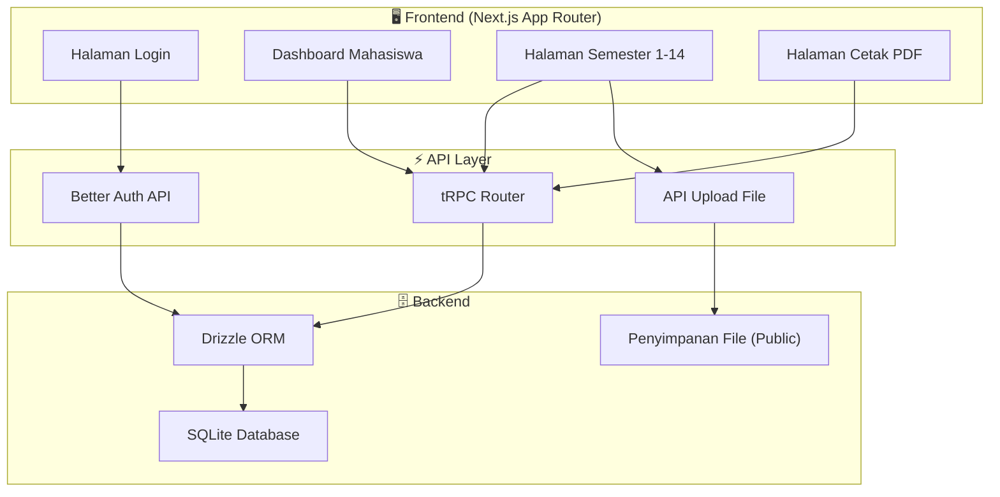
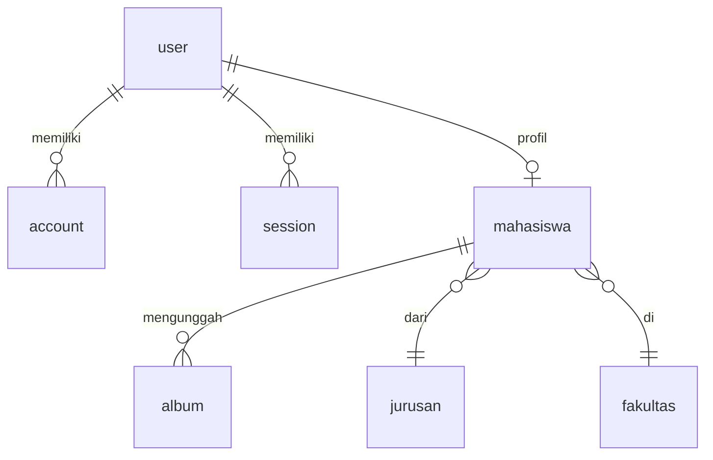
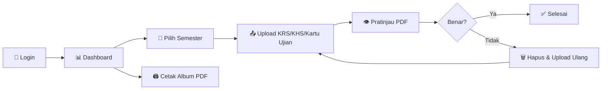

# 📚 Ringkasan Proyek — Album Akademik

## Deskripsi Umum

**Album Akademik** adalah aplikasi web berbasis Next.js yang dirancang untuk membantu mahasiswa mengelola dan mengarsipkan dokumen akademik mereka secara digital. Aplikasi ini memungkinkan mahasiswa mengunggah berkas PDF penting per semester (KRS, KHS, dan Kartu Ujian) selama masa perkuliahan hingga 14 semester, serta mencetak seluruh dokumen tersebut dalam satu file PDF yang rapi.

Proyek ini dikembangkan menggunakan arsitektur **T3 Stack** (`create-t3-app`), yang merupakan kombinasi teknologi modern untuk pengembangan full-stack yang *type-safe*.

---

## Teknologi yang Digunakan

| Kategori | Teknologi | Keterangan |
|---|---|---|
| **Framework** | Next.js 15 (App Router + Turbopack) | Framework React full-stack |
| **Bahasa** | TypeScript | Superset JavaScript dengan *type-safety* |
| **Styling** | Tailwind CSS 4 + shadcn/ui + Radix UI | Styling utility-first dengan komponen UI premium |
| **API** | tRPC v11 | API end-to-end type-safe tanpa REST/GraphQL |
| **Database** | SQLite (via libsql) | Database ringan berbasis file |
| **ORM** | Drizzle ORM | ORM TypeScript modern dan ringan |
| **Autentikasi** | Better Auth | Sistem autentikasi modern untuk Next.js |
| **State Management** | TanStack React Query | Manajemen state server-side |
| **PDF** | jsPDF + pdfjs-dist + html2canvas-pro | Pembuatan & rendering PDF di sisi klien |
| **Linting** | Biome | Linter & formatter all-in-one |
| **Package Manager** | pnpm | Package manager yang cepat dan efisien |

---

## Arsitektur Sistem



---

## Skema Database

Aplikasi memiliki **7 tabel utama**:

### Tabel Inti Aplikasi

| Tabel | Deskripsi |
|---|---|
| `album` | Menyimpan data file yang diunggah (KRS/KHS/Kartu Ujian) per semester per mahasiswa |
| `mahasiswa` | Data mahasiswa, terhubung ke tabel `user`, `jurusan`, dan `fakultas` |
| `fakultas` | Daftar fakultas (nama fakultas) |
| `jurusan` | Daftar jurusan/program studi (nama jurusan) |

### Tabel Better Auth (Autentikasi)

| Tabel | Deskripsi |
|---|---|
| `user` | Data pengguna (nama, email, role: admin/mahasiswa) |
| `account` | Akun penyedia autentikasi (email/password, OAuth, dll.) |
| `session` | Sesi aktif pengguna |
| `verification` | Token verifikasi (email, reset password, dll.) |

### Relasi Antar Tabel



---

## Fitur Utama

### 👨‍🎓 Sisi Mahasiswa

1. **Dashboard Ringkasan**
   - Menampilkan total berkas yang sudah diunggah vs yang dibutuhkan (maks. 42 berkas = 14 semester × 3 jenis)
   - Progress bar keseluruhan
   - Jumlah semester yang sudah selesai (3/3 berkas)
   - Jumlah semester yang sedang dalam proses (berkas parsial)
   - Ringkasan visual per semester dengan indikator warna (hijau = selesai, oranye = parsial, abu-abu = kosong)

2. **Manajemen Berkas Per Semester**
   - Halaman terpisah untuk setiap semester (Semester 1 – 14)
   - Upload 3 jenis dokumen PDF per semester:
     - **KRS** — Kartu Rencana Studi
     - **KHS** — Kartu Hasil Studi
     - **Kartu Ujian**
   - Pratinjau PDF langsung di browser menggunakan `pdfjs-dist`
   - Kemampuan mengganti atau menghapus file yang sudah diunggah
   - Validasi format file (hanya PDF)

3. **Cetak Album PDF**
   - Mencetak seluruh dokumen akademik dari Semester 1–14 dalam satu file PDF
   - Header pada setiap halaman menunjukkan jenis dokumen dan semester
   - Menggunakan `jsPDF` dan `html2canvas-pro` untuk rendering PDF berkualitas tinggi

### 🔐 Autentikasi & Keamanan

- Sistem login/registrasi menggunakan Better Auth
- Role-based access: **admin** dan **mahasiswa**
- Middleware proteksi rute — hanya pengguna terautentikasi yang bisa mengakses dashboard
- Semua endpoint tRPC dilindungi dengan `protectedProcedure`

### 👑 Sisi Admin

- *(Masih dalam pengembangan — belum diimplementasikan)*

---

## Struktur Proyek

```
album-akademik/
├── src/
│   ├── app/
│   │   ├── (mahasiswa)/          # Route group mahasiswa
│   │   │   ├── page.tsx          # Dashboard utama
│   │   │   ├── semester/[id]/    # Halaman per semester
│   │   │   ├── print/            # Halaman cetak PDF
│   │   │   └── layout.tsx        # Layout dengan sidebar
│   │   ├── _components/          # Komponen halaman
│   │   ├── api/
│   │   │   ├── auth/             # Better Auth endpoint
│   │   │   ├── trpc/             # tRPC endpoint
│   │   │   └── upload/           # API upload file
│   │   ├── login/                # Halaman login
│   │   └── layout.tsx            # Root layout
│   ├── components/
│   │   ├── app-sidebar.tsx       # Sidebar navigasi
│   │   ├── pdf-renderer.tsx      # Komponen render PDF
│   │   ├── upload-form.tsx       # Form upload berkas
│   │   └── ui/                   # Komponen shadcn/ui
│   ├── server/
│   │   ├── api/
│   │   │   ├── routers/album.ts  # Router tRPC untuk album
│   │   │   ├── root.ts           # Root router tRPC
│   │   │   └── trpc.ts           # Konfigurasi tRPC
│   │   ├── better-auth/          # Konfigurasi autentikasi
│   │   └── db/
│   │       ├── index.ts          # Koneksi database
│   │       └── schema.ts         # Skema Drizzle ORM
│   ├── hooks/                    # Custom React hooks
│   ├── lib/                      # Utility functions
│   ├── styles/                   # File CSS global
│   ├── trpc/                     # Setup klien tRPC
│   └── middleware.ts             # Middleware autentikasi
├── public/                       # Aset statis & file upload
├── drizzle.config.ts             # Konfigurasi Drizzle Kit
├── db.sqlite                     # File database SQLite
└── package.json                  # Dependensi & skrip
```

---

## Alur Kerja Pengguna (Mahasiswa)



---

> [!NOTE]
> Proyek ini merupakan bagian dari tugas akademik (ETS) dan dikembangkan menggunakan template `create-t3-app` versi 7.40.0. Fitur admin masih belum diimplementasikan (TBA).
